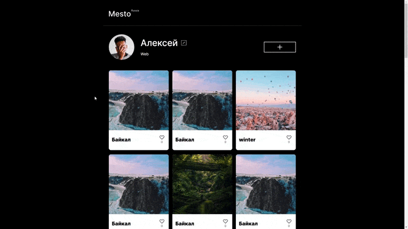

# Проект Mesto

[Посмотреть проект](https://ninja6228.github.io/mesto-project/)

## Описание
Интерактивный одностраничный сайт на нативном JS с адаптацией под различные виды устройств.  
Семантическая, кроссбраузерная, валидная вёрстка. 

## Стек технологий
 * JavaScript 
 * ООП (Классы)
 * БЭМ
 * Media queries
 * Flexbox
 * Grid Layout
 * Webpack
 * Npm
 * API
 * Парное программирование

## Рефакторинг кода
Функционал полностью переведен на ООП 
 

Выполнялся совместно с [Dmitrii Kushnerev](https://github.com/w0lrid)

## Ссылка на проект
[Click](https://ninja6228.github.io/mesto-project/)